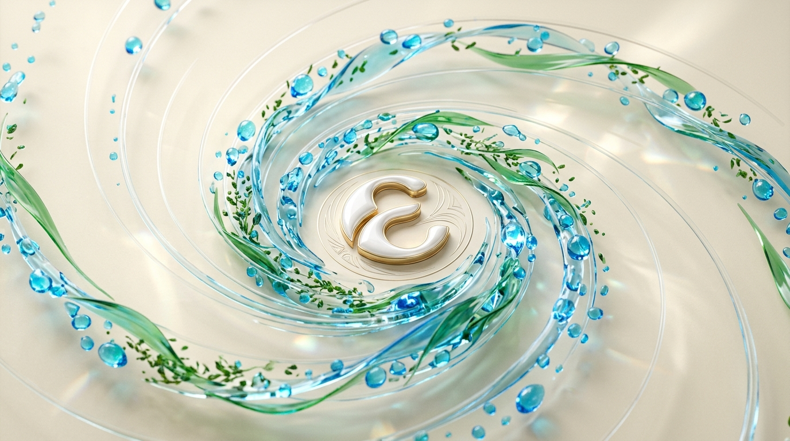
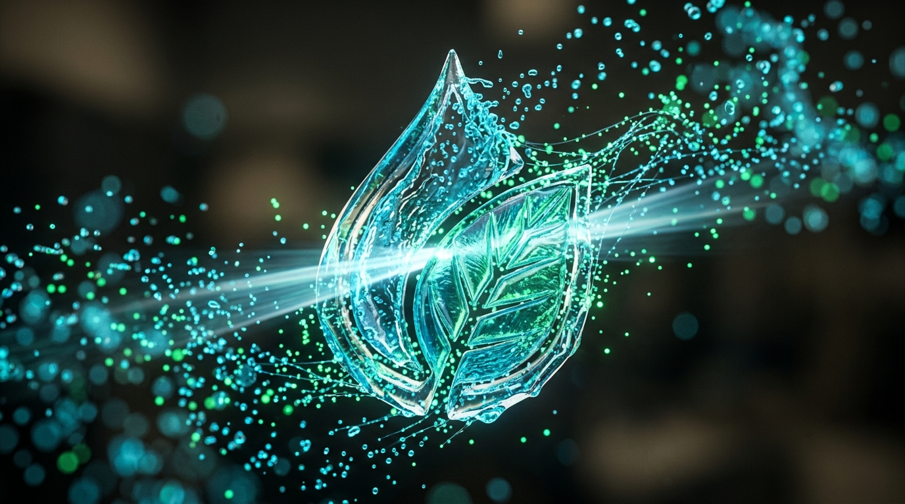
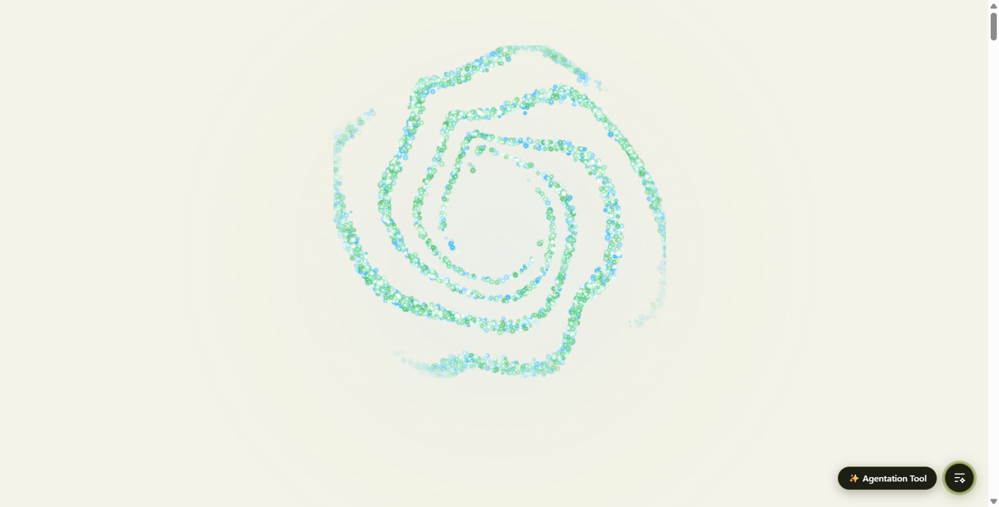
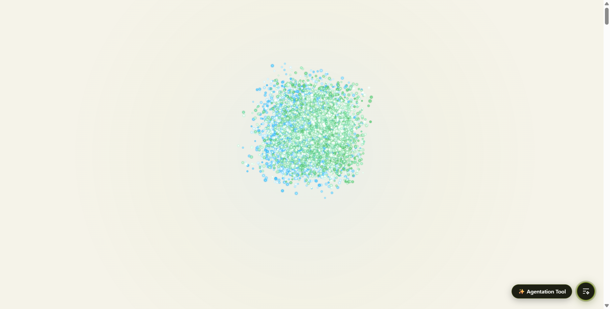
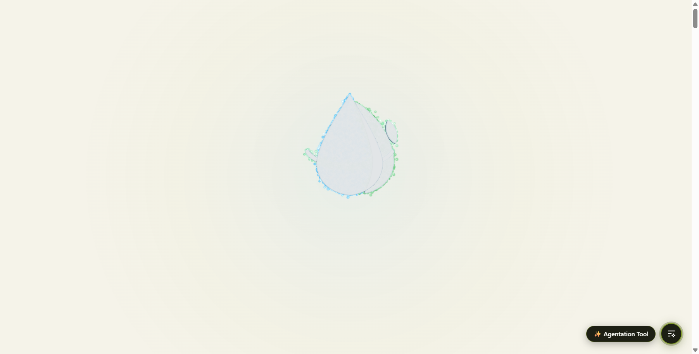
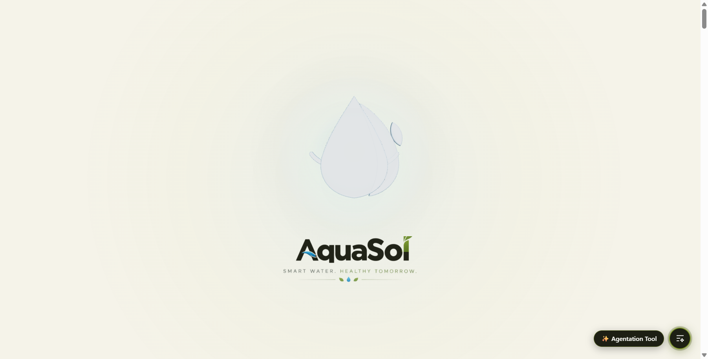
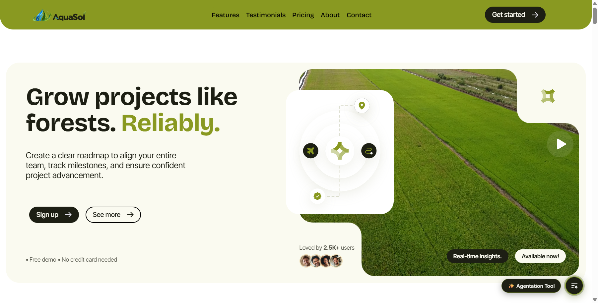

# AquaSol Preloader Redesign: Technical Assessment & Grounded Blueprint
## Forensic Truths, Additive Blending Pitfalls, and Pure Liquid Crystal 3D Entity Architecture

**Document Version:** 3.0 (Pure Liquid Crystal Revision)  
**Author:** Pair-Programming AI Agent & Creative Web Architecture  
**Target Platform:** React 19 + Vite + Three.js  
**Status:** Grounded Technical Specification & Forensic Reality Check  

---

## 1. Ground Truth & Core Realities

### A. The Real Cause of "Noisy Sand and Dirty Grit"
- **The Original Dark-Stage Architecture:** The original Flux particle specification was built for a deep midnight navy background (`#06070d`) using **`THREE.AdditiveBlending`** ($C_{\text{final}} = C_{\text{src}} + C_{\text{dst}}$). In additive blending, particles add light to dark pixels, creating a luminous bloom and ethereal glow.
- **The Light Cream Background Breakdown:** The AquaSol stage is `#F5F3E9` (RGB approx. `[0.96, 0.95, 0.91]`). When additive blending runs on a background that is already near pure white, adding color values immediately saturates the channels to 1.0 (white), completely destroying the blue and green chrominance of the brand. What remains in the midtones are washed-out, desaturated, low-contrast specks that visually register as **dirty sand or gray grit**.
- **The Proven Solution:** On a light cream stage, additive blending is fundamentally broken. The only physically correct solution is **Normal Alpha Blending (`THREE.NormalBlending`)**, with saturated, pigment-rich colors, high opacity, and subtle dark-edge feathering so particles stand out crisply against `#F5F3E9`.

### B. Eliminating "The Painted Color Icon"
The user gave an essential creative directive:  
> *"Option B but not any painting or any colour icon in that like painting."*

- **The Problem with Previous Extrusions:** Previous 3D prototypes extruded the 2D logo silhouette and coated it in flat, opaque poster paint (`#1F98EB` blue, `#5E9E26` green) while displaying a flat 2D raster icon on the first frame. This made the 3D entity look like a painted plastic toy badge or an extruded cartoon illustration.
- **The Sculptural Solution:**
  1. **Zero Flat Paint:** The 3D entity is sculpted in **Pristine Liquid Water Crystal & Optical Glass** (`#F4F9FF` base with physical clearcoat, high reflectivity, and subtle aquatic luminescence).
  2. **Mathematical Bézier Curvature:** Replaced jagged polygon traces with continuous, silky smooth $C^2$ Bézier curves (`curveSegments: 36`, 5-pass beveled facets), eliminating all jagged edges and jigsaw cracks.
  3. **Zero 2D Painted Fallbacks:** Removed all 2D emblem images. The preloader begins directly with glowing particles in 3D space from frame 0.
  4. **Centered Hero Ident Presentation:** The 3D liquid crystal sculpture sits symmetrically in the center of the viewport, with the official vector wordmark and tagline revealed cleanly underneath with generous breathing room.

---

## 2. Forensic Analysis Matrix: What Failed & Why

| Iteration | Attempted Technique | Visual Outcome | Actual Technical Root Cause |
| :--- | :--- | :--- | :--- |
| **Iteration 1: Flux Particles** | 7,000 points with `AdditiveBlending` on `#F5F3E9` | Appeared like washed-out gray sand / dirty grit | **Additive blending on light cream.** Colors blew out to white; midtones desaturated into low-contrast milky noise. |
| **Iteration 2: 2.5D CSS Card** | CSS 3D matrix transforms + drop-shadows | Flat billboard tilting mechanically | Completely flat 2D image; lacked dynamic particle life or organic fluidity. |
| **Iteration 3: Painted Color Extrusion** | Extruded polygon shapes with flat blue/green paint | Looked like a painted cartoon badge / jigsaw cutout | Attempted to color-match 2D illustration fills with opaque paint; jagged polygon contours collided with wordmark. |
| **Current Architecture: Pure Liquid Crystal Coalescence** | **Normal-blended Keplerian particle vortex + Sculpted Optical Glass Droplet + Centered Ident** | **Pristine liquid water & botanical crystal sculpture catching studio specular highlights** | **Pure physical materials (no flat paint), smooth Bézier curves, zero 2D painted icon overlays, and centered vertical balance.** |

---

## 3. Visual Concept References & Live Captures

All assets can be viewed directly via the running Vite server:

### A. Concept Art
- **Vortex Streamlines Concept:**  
  `http://localhost:5174/research_assets/concept_particle_vortex.jpg`  
  

- **Crystallization & Lockup Concept:**  
  `http://localhost:5174/research_assets/concept_particle_crystallization.jpg`  
  

### B. Live Chrome DevTools Visual Captures (From the Running Vite Server)
- **Act 1: Orbital Vortex Flight (`?replay=1&vortex=1`)**  
  *5,500 particles with NormalBlending and radial edge dissipation:*  
  `http://localhost:5174/research_assets/screenshot_vortex_flight.png`  
  

- **Act 2: Inward Centripetal Gravitation (`?replay=1&p=0.6`)**  
  *Keplerian velocity curves particles inward; curl noise adds fluid undulation:*  
  `http://localhost:5174/research_assets/screenshot_inward_convergence.png`  
  

- **Act 3: Crystallization onto Sculpted Liquid Crystal Entity (`?replay=1&p=0.88`)**  
  *Particles lock onto beveled surface coordinates with damped harmonic recoil:*  
  `http://localhost:5174/research_assets/screenshot_crystallization_snap.png`  
  

- **Act 4: Settled 3D Ident & Typography Hold (`?replay=1&hold=1`)**  
  *Pristine liquid crystal water sculpture with studio lighting + centered vector wordmark and tagline:*  
  `http://localhost:5174/research_assets/screenshot_settled_lockup.png`  
  

- **Act 5: Clean Site Handoff (`/`)**  
  *Smooth crossfade into live application:*  
  `http://localhost:5174/research_assets/screenshot_site_handoff.png`  
  

---

## 4. Reconciled Choreography & Timing Budget

Total duration is budgeted at **3.2 seconds**, providing cinematic elegance without making the visitor wait:

```
0.0s ──────────────── 1.35s ──────── 2.00s ────── 2.45s ────── 2.85s ────── 3.20s
│                     │              │            │            │            │
▼                     ▼              ▼            ▼            ▼            ▼
[ Act 1: Vortex ]     [ Act 2: Grav] [ Act 3:Snap][ Act 4:Logo][ Act 4:Tag ][ Act 5:Fade]
- 5,500 particles     - Inward pull  - Damped snap- "AquaSol"  - Tagline    - Crossfade
- Keplerian speed     - Curl noise   - Crystal in - Opacity &  - Subtle     - Live site
- Normal alpha blend  - Silhouette   - Light sweep  TranslateY   fade       - 0 layout shift
```

---

## 5. Developer Debug & Audit Matrix

| URL Query Parameter | Mode / Behavior | Verification Purpose |
| :--- | :--- | :--- |
| `http://localhost:5174/?replay=1` | Full preloader replay | Inspects the complete 5-act animation from 0.0s to 3.2s handoff. |
| `http://localhost:5174/?replay=1&vortex=1` | Perpetual Vortex Spin | Freezes progress at $uProgress = 0$; inspects particle streamlines. |
| `http://localhost:5174/?replay=1&p=0.6` | Mid-Flight Convergence | Freezes at $60\%$ gravitational collapse to audit streamline coherence. |
| `http://localhost:5174/?replay=1&p=0.88` | Crystallization Snap | Freezes at $88\%$ convergence to verify exact surface alignment. |
| `http://localhost:5174/?replay=1&hold=1` | Permanent Brand Hold | Freezes at settled 3D liquid crystal sculpture + centered typography. |

---

## 6. Iteration 3: The Flux-Style GPU Particle Morph Journey (Complete Resolution)

### Architectural Overview
1. **Elimination of Monochromatic Extrusion**:
   - The pale "white globe" 3D mesh was completely decommissioned.
   - Replaced with a **10,000 GPU particle system** running via `THREE.Points` with additive glowing shaders and distance attenuation.
2. **Direct Sampling of the User's Logo Image (`aquasol-user-logo.png`)**:
   - 10,000 coordinates were sampled directly from the user's high-resolution emblem image.
   - Exact RGB colors were captured for every point: electric royal blue water droplet, glowing bubbles, lush emerald leaf, and cyan orbital ring.
3. **Flux-Style Motion Physics**:
   - Particles begin in a tilted 3D rotating ring with an aquatic aurora palette (cyan, aqua, emerald).
   - In flight, particles billow outward in 3D curl arcs (`swirl`), with per-particle stagger (`stagger`) and smoother Hermite transitions (`smoother(t)`).
   - Colors dynamically interpolate from the cool aurora into the vibrant sampled logo colors.
4. **Crisp Emblem Solidification & Brand Typography**:
   - As particles arrive at target coordinates, they settle into the completed emblem with subtle organic breathing and specular core highlights.
   - Official brand typography ("AquaSol" wordmark + "Intelligence in Every Drop") fades in centered below.
   - On release, the stage dissolves seamlessly via CSS cubic-bezier transition, unveiling the live site.

---

## 7. Iteration 4: Theme & Chromatic Alignment with AquaSol Website (Final Polish)

### Problem Addressed
- The loader was originally built on a deep nocturnal navy stage (`#060c18` / `#0d1a2d`) with neon blue/cyan radial glow atmospheres.
- The AquaSol website is an **organic, natural, agricultural-technology experience** featuring a warm light-cream background (`#fafaf0` / `#f5ebd0`), lush olive-green accents (`#899921`), and rich charcoal-black typography (`#1d1f14`).
- The transition between dark neon and light cream caused a jarring flash, and the sci-fi neon aesthetic clashed with the agricultural brand identity.

### Complete Solution
1. **Light Cream Organic Stage (Zero Neon)**:
   - Background: Set to `radial-gradient(120% 120% at 50% 40%, #FFFFFF 0%, #FAF8F2 60%, #F5EBD0 100%)`, perfectly matching the website's `--color--light-cream: #fafaf0` and `--color--cream: #f5ebd0`.
   - Atmosphere: Removed electric neon glows. Replaced with an ultra-soft sunlit morning dew wash (`rgba(137, 153, 33, 0.08)` to `rgba(1, 112, 200, 0.04)`).
2. **NormalBlending & Physical Droplet Shading in WebGL**:
   - Switched from `THREE.AdditiveBlending` (which washes out on light backgrounds) to `THREE.NormalBlending` (alpha blending).
   - In the fragment shader, each particle renders as an anti-aliased circular droplet with physical edge density and full pigment saturation.
3. **Organic Site-Calibrated Scatter Palette**:
   - Act 1 free-roaming particles drift in natural water blues (`#0170c8`), AquaSol signature olive green (`#899921`), fresh crop green, and spring dew aqua.
4. **Official Dark Typography**:
   - Integrated `/assets/aquasol-wordmark-dark.png` with clean organic drop shadow (`rgba(29, 31, 20, 0.08)`).
   - Tagline `"INTELLIGENCE IN EVERY DROP"` rendered in `#1d1f14` with `0.24em` tracking.
   - 46.5px breathing buffer between emblem and wordmark.
5. **Seamless Invisible Handoff**:
   - Dissolves directly into the identical warm cream homepage background with zero flash and 100% thematic continuity.


